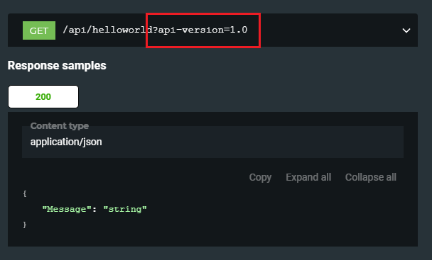

# Ibistic.Public.NSwag.Extensions
A framework that provides extensions to create OpenAPI 3.0 specifications with NSwag.

NSwag toolchain used from https://github.com/RicoSuter/NSwag under the license https://github.com/RicoSuter/NSwag/blob/master/LICENSE.md.

Please only use this component if you agree to and comply with the above license terms.

## Install

To install Ibistic.Public.NSwag.Extensions, run the following command in the Package Manager Console

    PM> Install-Package Ibistic.Public.NSwag.Extensions

## Documentation

Ibistic.Public.NSwag.Extensions has by now one new api version processor.

### ApiVersionQueryStringProcessor

The api version processor from NSwag (NSwagProcessors.ApiVersionProcessor) only works when the versioning strategy used is based on the uri, i.e. /api/1.0/helloworld.

ApiVersionQueryStringProcessor has been built to query string versioning, which is the default versioning mode in Web API 2, i.e. /api/helloworld?api-version=1.0.

The way to use it is just to specify the new processor when the Open API specification is gonna be created. There are several ways to create that specification, by command line would be:

nswag webapi2openapi 
/operationprocessors:Ibistic.Public.NSwag.Extensions:Ibistic.Public.NSwag.Extensions.ApiVersionQueryStringProcessor
/referencepaths:MyNugetAssemblyPath
/assembly:MyWebAPI.dll
/output:OpenApiDocument.OpenApi.json
/outputtype:openapi3"

where MyNugetAssemblyPath is the folder where Ibistic.Public.NSwag.Extensions has been installed.

Remember to decorate your controllers and/or actions with the [ApiVersion] attribute.

``` csharp
    [ApiVersion("1.0")]
    [RoutePrefix("api/helloworld")]
    public sealed class HelloWorldController : ApiController
```

This is the result once the specificacion is created (used Redoc to render it).



## License

This library is offered as is free for all under the MIT license: https://opensource.org/licenses/MIT

Copyright � Ibistic Technologies 2019
